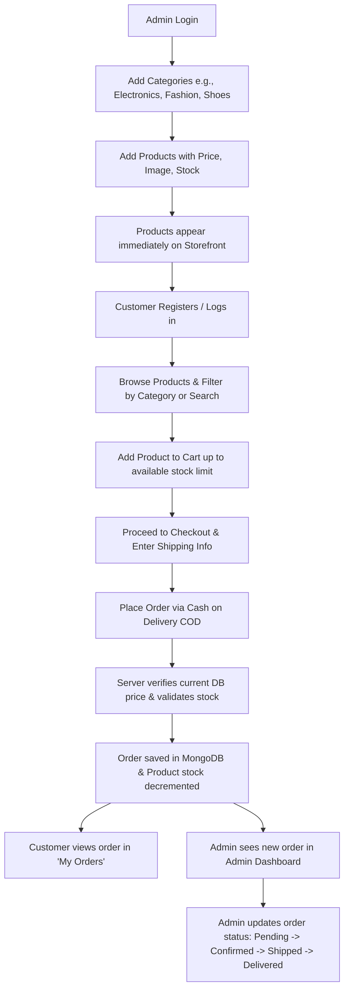

# Mini E-Commerce Demo Project (MERN Stack)

A lightweight, clean, and modern **Mini E-Commerce Demo Web Application** built using the **MERN Stack** (MongoDB, Express.js, React.js, Node.js) with **Vite** and **Tailwind CSS**.

---

## 📌 Project Overview

This project is a streamlined, full-stack e-commerce demo application designed to demonstrate core e-commerce workflows without the bloat of third-party payment gateways, complex microservices, multi-vendor features, or heavy analytics.

The application features:
1. **Public Customer Storefront**: Product browsing, category filtering, search, dynamic cart with stock limits, Cash on Delivery (COD) checkout, and order tracking.
2. **Admin Management Dashboard**: Category CRUD, Product CRUD, and Customer Order lifecycle status management.
3. **Robust Backend**: RESTful API built on Express & Mongoose, with JWT authentication, role-based access control, server-side price validation, and stock decrement logic.

---

## 🚀 Tech Stack

| Domain | Technology | Description |
| :--- | :--- | :--- |
| **Frontend** | [React.js](https://react.dev/) + [Vite](https://vitejs.dev/) | Fast, modular component-driven single page application (SPA) |
| **Styling** | [Tailwind CSS](https://tailwindcss.com/) | Modern utility-first CSS framework for clean, responsive UI |
| **Icons & UI** | [Lucide React](https://lucide.dev/) | Clean and consistent UI icons |
| **HTTP Client** | [Axios](https://axios-http.com/) | Promise-based HTTP client with interceptors for JWT tokens |
| **Backend** | [Node.js](https://nodejs.org/) & [Express.js](https://expressjs.com/) | Lightweight and extensible REST API server |
| **Database** | [MongoDB](https://www.mongodb.com/) & [Mongoose](https://mongoosejs.com/) | Document database with schema enforcement and validation |
| **Authentication** | [JWT (JSON Web Tokens)](https://jwt.io/) & [bcryptjs](https://github.com/dcodeIO/bcrypt.js) | Stateless token auth & secure salted password hashing |

---

## 📂 Project Structure

The project is structured as a decoupled monorepo with clear separation between frontend and backend:

```text
MINIAI_project/
├── client/                      # React frontend (Vite)
│   ├── public/                  # Static assets
│   ├── src/
│   │   ├── api/                 # Axios instance and API call services
│   │   ├── assets/              # Images, logos, illustrations
│   │   ├── components/          # Reusable UI components
│   │   │   ├── common/          # Button, Modal, Card, Input, Loader, Badge
│   │   │   ├── layout/          # Navbar, Footer, AdminLayout, Sidebar
│   │   │   └── product/         # ProductCard, ProductGrid, CategoryFilter
│   │   ├── context/             # AuthContext, CartContext
│   │   ├── pages/               # Storefront & Admin Page views
│   │   │   ├── admin/           # Admin Dashboard, Categories, Products, Orders
│   │   │   ├── Cart.jsx         # Cart page with quantity adjustments
│   │   │   ├── Checkout.jsx     # Shipping address & COD order placement
│   │   │   ├── Home.jsx         # Hero section & featured products
│   │   │   ├── Login.jsx        # Customer & Admin login
│   │   │   ├── MyOrders.jsx     # Customer order history
│   │   │   ├── ProductDetails.jsx # Detailed product view & stock display
│   │   │   ├── Products.jsx     # Full product catalog with filter & search
│   │   │   └── Register.jsx     # Customer signup page
│   │   ├── routes/              # Public, Protected, and Admin Route guards
│   │   ├── App.jsx              # Main routing configuration
│   │   ├── index.css            # Tailwind CSS directives
│   │   └── main.jsx             # React entry point
│   ├── index.html
│   ├── package.json
│   ├── tailwind.config.js
│   └── vite.config.js
│
├── server/                      # Node.js + Express backend
│   ├── src/
│   │   ├── config/              # Database connection (db.js)
│   │   ├── controllers/         # Business logic (auth, category, product, order)
│   │   ├── middleware/          # authMiddleware.js, adminMiddleware.js, errorMiddleware.js
│   │   ├── models/              # User.js, Category.js, Product.js, Order.js
│   │   ├── routes/              # authRoutes.js, categoryRoutes.js, productRoutes.js, orderRoutes.js
│   │   ├── utils/               # Token generator, seed helper
│   │   ├── app.js               # Express application initialization & middleware
│   │   └── server.js            # Server entry point & listener
│   ├── .env.example             # Example environment variables
│   └── package.json
│
├── docs/                        # Detailed Architectural & Technical Specifications
│   ├── ARCHITECTURE.md          # System architecture, data flow & monorepo layout
│   ├── DATABASE_DESIGN.md       # MongoDB schemas, Mongoose models, indexes & validations
│   ├── API_SPECIFICATION.md     # Complete REST API endpoint documentation
│   ├── FRONTEND_SPECIFICATION.md# Page components, layouts, state & Tailwind guidelines
│   ├── SECURITY_AND_VALIDATION.md# Security rules, price verification & validation specs
│   └── PROJECT_ROADMAP.md       # Phased implementation plan & demo walkthrough
└── README.md                    # Root project documentation
```

---

## 📑 Detailed Documentation Index

For in-depth technical details, please refer to the documents in the [`docs/`](./docs/) directory:

1. [**System Architecture & Data Flow (`docs/ARCHITECTURE.md`)**](./docs/ARCHITECTURE.md)  
   Monorepo architecture, application layers, authentication lifecycle, and state management.

2. [**Database Models & Schema Design (`docs/DATABASE_DESIGN.md`)**](./docs/DATABASE_DESIGN.md)  
   Mongoose models for `User`, `Category`, `Product`, and `Order`, field definitions, validation constraints, and relationships.

3. [**REST API Specification (`docs/API_SPECIFICATION.md`)**](./docs/API_SPECIFICATION.md)  
   Complete specification of all REST endpoints, query parameters, request/response JSON payloads, and HTTP status codes.

4. [**Frontend & UI/UX Specification (`docs/FRONTEND_SPECIFICATION.md`)**](./docs/FRONTEND_SPECIFICATION.md)  
   Screen layouts, user journey, Tailwind CSS styling system, responsive grid layouts, and reusable components.

5. [**Security, Validation & Stock Integrity (`docs/SECURITY_AND_VALIDATION.md`)**](./docs/SECURITY_AND_VALIDATION.md)  
   Zero-trust pricing architecture, backend validation rules, JWT lifecycle, bcrypt password hashing, and race condition prevention.

6. [**Project Roadmap & Demo Flow (`docs/PROJECT_ROADMAP.md`)**](./docs/PROJECT_ROADMAP.md)  
   Step-by-step phased execution guide, verification checklist, and the primary end-to-end demo execution script.

---

## 🔄 Main Demo Flow



---

## ⚙️ Environment Variables Reference

### Backend (`server/.env`)

```env
PORT=5000
NODE_ENV=development
MONGO_URI=mongodb://localhost:27017/mini_ecommerce
JWT_SECRET=your_super_secret_jwt_key_here
JWT_EXPIRE=7d
ADMIN_EMAIL=admin@example.com
ADMIN_PASSWORD=adminpassword123
```

### Frontend (`client/.env`)

```env
VITE_API_BASE_URL=http://localhost:5000/api
```

---

## 🛡️ Key Principles

- **No Over-Engineering**: Deliberately avoids microservices, GraphQL, external payment gateways (Stripe/PayPal), Redux/Zustand overhead, multi-tenant databases, or complicated CI/CD scripts.
- **Server Price Authority**: Product prices sent from the client cart are strictly ignored when creating an order. The server queries the latest prices directly from MongoDB to compute `totalAmount`.
- **Stock Guard**: The backend validates and atomically decrements product stock upon checkout to prevent overselling.
- **Clean Tailwind UI**: Clean neutral palette, clear visual hierarchy, accessible contrast, responsive breakpoints (`sm`, `md`, `lg`, `xl`), and smooth interactive states.
