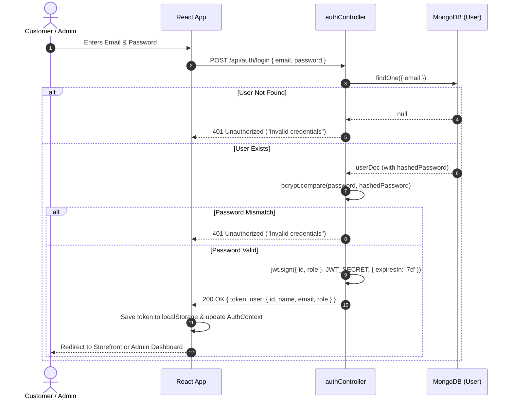
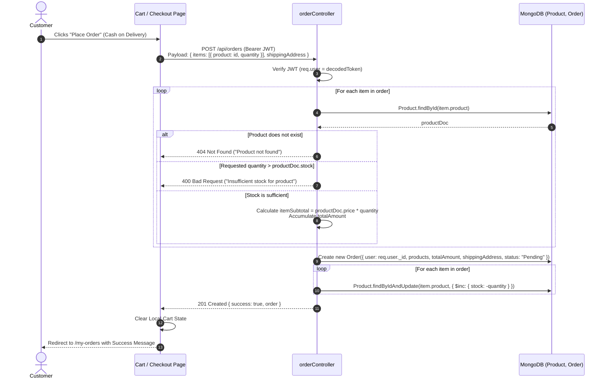
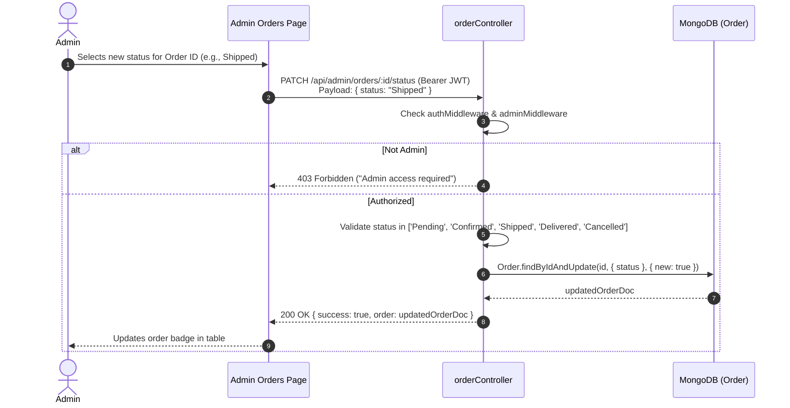

# System Architecture & Technical Design

This document details the architectural design, layer responsibilities, state management, and request-response lifecycles for the **Mini E-Commerce Demo Project (MERN Stack)**.

---

## 1. High-Level Architecture

The application adopts a decoupled **Single Page Application (SPA) + REST API Client-Server Architecture**:

```
+-------------------------------------------------------------+
|                      Client Layer                           |
|       (React.js + Vite + Tailwind CSS + Axios)              |
|                                                             |
|  +--------------------+             +--------------------+  |
|  |  Customer Store    |             |  Admin Dashboard   |  |
|  |  (Home, Products,  |             |  (Categories,      |  |
|  |   Cart, Checkout)  |             |   Products, Orders)|  |
|  +---------+----------+             +---------+----------+  |
|            |                                  |             |
|            +----------------+-----------------+             |
|                             |                               |
|                     Axios Client                            |
|             (JWT Bearer Token Interceptor)                  |
+-----------------------------+-------------------------------+
                              |
                     HTTPS / JSON REST
                              |
+-----------------------------v-------------------------------+
|                      Server Layer                           |
|                  (Node.js + Express.js)                     |
|                                                             |
|  +-------------------------------------------------------+  |
|  | Express Router (auth, categories, products, orders)    |  |
|  +---------------------------+---------------------------+  |
|                              |                              |
|  +---------------------------v---------------------------+  |
|  | Middleware (Auth JWT Verify, Admin Guard, Validation) |  |
|  +---------------------------+---------------------------+  |
|                              |                              |
|  +---------------------------v---------------------------+  |
|  | Controllers (Business Logic & Transactions)           |  |
|  +---------------------------+---------------------------+  |
|                              |                              |
|  +---------------------------v---------------------------+  |
|  | Mongoose Models (User, Category, Product, Order)      |  |
|  +---------------------------+---------------------------+  |
+------------------------------+------------------------------+
                               |
                        TCP / Mongoose ODM
                               |
+------------------------------v-------------------------------+
|                      Database Layer                         |
|                   (MongoDB Database)                        |
|                                                             |
|   [users]        [categories]      [products]      [orders] |
+-------------------------------------------------------------+
```

---

## 2. Directory Layout & Layer Responsibilities

### 2.1 Backend Layer (`/server`)

The backend follows an organized layered pattern separating routing, middleware, controllers, and data models:

```text
server/
├── src/
│   ├── config/
│   │   └── db.js                 # MongoDB connection with Mongoose
│   ├── controllers/
│   │   ├── authController.js     # User registration, login, profile check
│   │   ├── categoryController.js # Admin CRUD for categories, public list
│   │   ├── productController.js  # Admin CRUD, public listing, search & filter
│   │   └── orderController.js    # Order creation, customer history, admin view & status update
│   ├── middleware/
│   │   ├── authMiddleware.js     # Verifies JWT token in Bearer authorization header
│   │   ├── adminMiddleware.js    # Verifies req.user.role === 'admin'
│   │   └── errorMiddleware.js    # Centralized 404 and 500 JSON error handler
│   ├── models/
│   │   ├── User.js               # User schema with bcrypt pre-save hash & comparePassword
│   │   ├── Category.js           # Category schema (name, description)
│   │   ├── Product.js            # Product schema (name, price, stock, category reference)
│   │   └── Order.js              # Order schema (user, items, total, shipping, status)
│   ├── routes/
│   │   ├── authRoutes.js         # /api/auth
│   │   ├── categoryRoutes.js     # /api/categories
│   │   ├── productRoutes.js      # /api/products
│   │   └── orderRoutes.js        # /api/orders & /api/admin/orders
│   ├── utils/
│   │   ├── generateToken.js      # JWT signing utility
│   │   └── seeder.js             # Optional database seeder for admin & sample products
│   ├── app.js                    # Express app initialization, CORS, JSON parser, route bindings
│   └── server.js                 # Entry point listening on process.env.PORT
├── .env.example
└── package.json
```

### 2.2 Frontend Layer (`/client`)

The frontend uses Vite with React 18+, utilizing React Router for declarative navigation and React Context for lightweight global state:

```text
client/
├── src/
│   ├── api/
│   │   ├── axiosInstance.js      # Axios instance configured with baseURL and JWT interceptor
│   │   ├── authApi.js            # auth API calls
│   │   ├── categoryApi.js        # category API calls
│   │   ├── productApi.js         # product API calls
│   │   └── orderApi.js           # order API calls
│   ├── components/
│   │   ├── common/
│   │   │   ├── Alert.jsx         # Status feedback
│   │   │   ├── Button.jsx        # Standardized button variants
│   │   │   ├── ConfirmModal.jsx  # Deletion confirmation dialog
│   │   │   ├── Input.jsx         # Form input with validation error display
│   │   │   ├── LoadingSpinner.jsx# Centered or inline loading indicator
│   │   │   └── Toast.jsx         # Floating toast alert message
│   │   ├── layout/
│   │   │   ├── AdminLayout.jsx   # Admin shell with fixed/collapsible sidebar
│   │   │   ├── AdminSidebar.jsx  # Admin navigation menu
│   │   │   ├── Footer.jsx        # Public footer
│   │   │   └── Navbar.jsx        # Public responsive navigation with cart count & user dropdown
│   │   └── product/
│   │       ├── CategoryFilter.jsx# Horizontal category badge selector
│   │       ├── ProductCard.jsx   # Product display with price, stock status & Add-to-Cart
│   │       └── SearchBar.jsx     # Search input with debounce support
│   ├── context/
│   │   ├── AuthContext.jsx       # Auth state (user, token, role, login, logout)
│   │   └── CartContext.jsx       # Cart state (items, addItem, updateQty, removeItem, clearCart)
│   ├── pages/
│   │   ├── admin/
│   │   │   ├── AdminCategories.jsx # Category list, create modal, edit modal, delete dialog
│   │   │   ├── AdminDashboard.jsx  # Overview metrics (count of products, categories, orders)
│   │   │   ├── AdminOrders.jsx     # Customer orders table with status badge & updater dropdown
│   │   │   └── AdminProducts.jsx   # Product table, add/edit modal, stock display
│   │   ├── Cart.jsx              # Line items, quantity controls (bounded by stock), subtotal
│   │   ├── Checkout.jsx          # Shipping address form and Cash on Delivery placement
│   │   ├── Home.jsx              # Banner, category highlights, latest products
│   │   ├── Login.jsx             # Combined customer/admin login
│   │   ├── MyOrders.jsx          # Logged-in customer order history with status timeline
│   │   ├── ProductDetails.jsx    # Single product view with full description & stock counter
│   │   ├── Products.jsx          # Full catalog with search, category filters, and grid
│   │   └── Register.jsx          # Customer registration form
│   ├── routes/
│   │   ├── AdminRoute.jsx        # Guard: requires isAuthenticated && role === 'admin'
│   │   └── PrivateRoute.jsx      # Guard: requires isAuthenticated
│   ├── App.jsx                   # Route provider configuration
│   ├── index.css                 # Tailwind base, components, and utilities
│   └── main.jsx                  # React DOM mount wrapped in Context Providers
├── index.html
├── package.json
├── tailwind.config.js
└── vite.config.js
```

---

## 3. Core Sequence Diagrams

### 3.1 Authentication & Authorization Flow



---

### 3.2 Customer Order Placement & Stock Decrement



---

### 3.3 Admin Order Status Lifecycle Management



---

## 4. State Management Strategy

To maintain minimalism, external state libraries like Redux or Zustand are avoided in favor of **React Built-in Context**:

1. **`AuthContext`**:
   - Holds `{ user, token, isAuthenticated, isAdmin, loading }`.
   - On initial page mount, reads `localStorage.getItem('token')` and `localStorage.getItem('user')` to restore session.
   - Provides `login(userData, token)` and `logout()` helpers.

2. **`CartContext`**:
   - Holds `{ cartItems, totalItems, cartTotal }`.
   - Persists state in `localStorage.getItem('cart')`.
   - Provides methods:
     - `addToCart(product, quantity)`: Checks existing quantity against `product.stock` before adding.
     - `updateQuantity(productId, quantity)`: Clamps minimum to 1 and maximum to `product.stock`.
     - `removeFromCart(productId)`: Deletes line item.
     - `clearCart()`: Cleans up after successful order placement.
