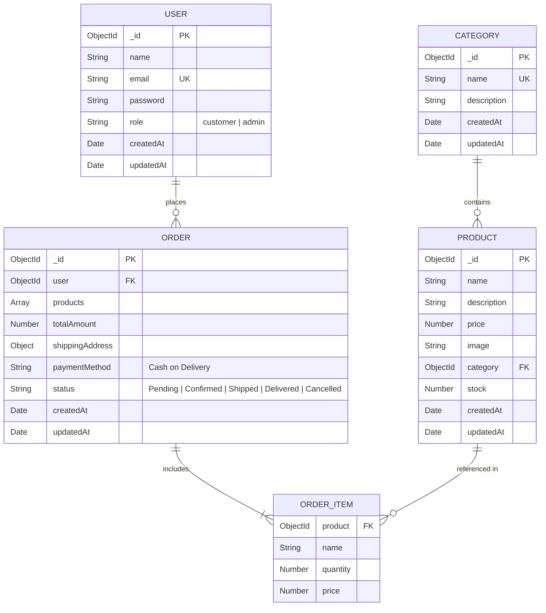

# Database Models & Schema Design

This document provides the complete schema specifications, constraints, indexing strategies, and relationships for the MongoDB database using **Mongoose ODM**.

---

## 1. Entity-Relationship Diagram (ERD)



---

## 2. Models Specification

The system restricts data persistence to exactly **four models**: `User`, `Category`, `Product`, and `Order`.

### 2.1 User Model (`models/User.js`)

Stores credentials and role identifiers for both customers and administrators.

| Field Name | Type | Constraints | Description |
| :--- | :--- | :--- | :--- |
| `_id` | `ObjectId` | Primary Key, Auto-generated | Unique identifier |
| `name` | `String` | Required, Trimmed, Max 100 chars | Full name of the user |
| `email` | `String` | Required, Unique, Lowercase, Trimmed, Valid Email | Authentication identifier |
| `password` | `String` | Required, Minimum length 6 | Salted bcrypt hash |
| `role` | `String` | Enum: `['customer', 'admin']`, Default: `'customer'` | Role-based access control |
| `createdAt` | `Date` | Timestamp, Auto-generated | Account creation date |
| `updatedAt` | `Date` | Timestamp, Auto-generated | Last profile update date |

#### Mongoose Schema Definition:

```javascript
const userSchema = new mongoose.Schema(
  {
    name: {
      type: String,
      required: [true, 'Name is required'],
      trim: true,
      maxlength: [100, 'Name cannot exceed 100 characters'],
    },
    email: {
      type: String,
      required: [true, 'Email is required'],
      unique: true,
      lowercase: true,
      trim: true,
      match: [
        /^\w+([\.-]?\w+)*@\w+([\.-]?\w+)*(\.\w{2,3})+$/,
        'Please provide a valid email address',
      ],
    },
    password: {
      type: String,
      required: [true, 'Password is required'],
      minlength: [6, 'Password must be at least 6 characters long'],
    },
    role: {
      type: String,
      enum: ['customer', 'admin'],
      default: 'customer',
    },
  },
  { timestamps: true }
);
```

#### Pre-Save Hooks & Methods:
- **`pre('save')`**: Hashes `password` using `bcrypt.genSalt(10)` only if modified.
- **`comparePassword(candidatePassword)`**: Compares input password against stored hash using `bcrypt.compare`.

---

### 2.2 Category Model (`models/Category.js`)

Enables classification of catalog items into navigable segments (e.g., Electronics, Fashion, Shoes).

| Field Name | Type | Constraints | Description |
| :--- | :--- | :--- | :--- |
| `_id` | `ObjectId` | Primary Key, Auto-generated | Unique identifier |
| `name` | `String` | Required, Unique, Trimmed, Max 50 chars | Category title |
| `description`| `String` | Optional, Trimmed, Max 250 chars | Brief summary of category |
| `createdAt` | `Date` | Timestamp, Auto-generated | Timestamp |
| `updatedAt` | `Date` | Timestamp, Auto-generated | Timestamp |

#### Mongoose Schema Definition:

```javascript
const categorySchema = new mongoose.Schema(
  {
    name: {
      type: String,
      required: [true, 'Category name is required'],
      unique: true,
      trim: true,
      maxlength: [50, 'Category name cannot exceed 50 characters'],
    },
    description: {
      type: String,
      trim: true,
      maxlength: [250, 'Description cannot exceed 250 characters'],
      default: '',
    },
  },
  { timestamps: true }
);
```

---

### 2.3 Product Model (`models/Product.js`)

Represents sellable items in the store with stock counters and categorization.

| Field Name | Type | Constraints | Description |
| :--- | :--- | :--- | :--- |
| `_id` | `ObjectId` | Primary Key, Auto-generated | Unique identifier |
| `name` | `String` | Required, Trimmed, Max 150 chars | Product title |
| `description`| `String` | Required, Trimmed, Max 2000 chars | Detailed product explanation |
| `price` | `Number` | Required, Min: 0 | Selling price in currency units |
| `image` | `String` | Required, Trimmed, Valid URL format | Image web link or placeholder |
| `category` | `ObjectId` | Required, Ref: `'Category'` | Associated category |
| `stock` | `Number` | Required, Min: 0, Default: 0 | Available inventory units |
| `createdAt` | `Date` | Timestamp, Auto-generated | Timestamp |
| `updatedAt` | `Date` | Timestamp, Auto-generated | Timestamp |

#### Mongoose Schema Definition:

```javascript
const productSchema = new mongoose.Schema(
  {
    name: {
      type: String,
      required: [true, 'Product name is required'],
      trim: true,
      maxlength: [150, 'Product name cannot exceed 150 characters'],
    },
    description: {
      type: String,
      required: [true, 'Product description is required'],
      trim: true,
    },
    price: {
      type: Number,
      required: [true, 'Product price is required'],
      min: [0, 'Price must be a positive number'],
    },
    image: {
      type: String,
      required: [true, 'Product image URL is required'],
      trim: true,
    },
    category: {
      type: mongoose.Schema.Types.ObjectId,
      ref: 'Category',
      required: [true, 'Category reference is required'],
    },
    stock: {
      type: Number,
      required: [true, 'Stock count is required'],
      min: [0, 'Stock cannot be negative'],
      default: 0,
    },
  },
  { timestamps: true }
);

// Search Index for query filter optimization
productSchema.index({ name: 'text', description: 'text' });
productSchema.index({ category: 1 });
```

---

### 2.4 Order Model (`models/Order.js`)

Records customer purchase transactions, item snapshots, shipping addresses, and lifecycle statuses.

| Field Name | Type | Constraints | Description |
| :--- | :--- | :--- | :--- |
| `_id` | `ObjectId` | Primary Key, Auto-generated | Unique order number |
| `user` | `ObjectId` | Required, Ref: `'User'` | Customer who placed order |
| `products` | `Array` | Required, Non-empty array | Line items (snapshot of purchase) |
| `products[].product`| `ObjectId`| Required, Ref: `'Product'` | ID of original product |
| `products[].name`| `String`| Required | Product name at time of order |
| `products[].quantity`| `Number`| Required, Min: 1 | Number of units ordered |
| `products[].price` | `Number`| Required, Min: 0 | Server-verified price at purchase |
| `totalAmount` | `Number` | Required, Min: 0 | Sum of line item prices * quantities |
| `shippingAddress` | `Object` | Required | Shipping destination details |
| `shippingAddress.name` | `String` | Required | Recipient full name |
| `shippingAddress.phone` | `String` | Required | Recipient contact phone number |
| `shippingAddress.address` | `String` | Required | Street, building, door details |
| `shippingAddress.city` | `String` | Required | Destination city |
| `shippingAddress.pincode` | `String` | Required | Postal / Zip code |
| `paymentMethod` | `String` | Default: `'Cash on Delivery'` | Fixed payment mechanism |
| `status` | `String` | Enum: `['Pending', 'Confirmed', 'Shipped', 'Delivered', 'Cancelled']`, Default: `'Pending'` | Lifecycle state |
| `createdAt` | `Date` | Timestamp, Auto-generated | Timestamp |
| `updatedAt` | `Date` | Timestamp, Auto-generated | Timestamp |

#### Mongoose Schema Definition:

```javascript
const orderItemSchema = new mongoose.Schema({
  product: {
    type: mongoose.Schema.Types.ObjectId,
    ref: 'Product',
    required: true,
  },
  name: {
    type: String,
    required: true,
  },
  quantity: {
    type: Number,
    required: true,
    min: [1, 'Quantity must be at least 1'],
  },
  price: {
    type: Number,
    required: true,
    min: [0, 'Price must be positive'],
  },
});

const shippingAddressSchema = new mongoose.Schema({
  name: { type: String, required: true, trim: true },
  phone: { type: String, required: true, trim: true },
  address: { type: String, required: true, trim: true },
  city: { type: String, required: true, trim: true },
  pincode: { type: String, required: true, trim: true },
});

const orderSchema = new mongoose.Schema(
  {
    user: {
      type: mongoose.Schema.Types.ObjectId,
      ref: 'User',
      required: true,
    },
    products: {
      type: [orderItemSchema],
      required: true,
      validate: [val => val.length > 0, 'Order must contain at least one product'],
    },
    totalAmount: {
      type: Number,
      required: true,
      min: [0, 'Total amount must be positive'],
    },
    shippingAddress: {
      type: shippingAddressSchema,
      required: true,
    },
    paymentMethod: {
      type: String,
      default: 'Cash on Delivery',
    },
    status: {
      type: String,
      enum: ['Pending', 'Confirmed', 'Shipped', 'Delivered', 'Cancelled'],
      default: 'Pending',
    },
  },
  { timestamps: true }
);

orderSchema.index({ user: 1, createdAt: -1 });
orderSchema.index({ status: 1 });
```

---

## 3. Stock Integrity & Consistency Rules

1. **Snapshot Isolation**: When an order is placed, `name` and `price` are copied into `order.products[]`. If an admin later updates the product price or title, previous order historical records remain immutable.
2. **Server-Side Price Authority**: The frontend submits only product IDs and requested quantities:
   ```json
   {
     "items": [
       { "productId": "651a2b3c4d...", "quantity": 2 }
     ],
     "shippingAddress": { ... }
   }
   ```
   The backend fetches the fresh `Product` record from the database to compute the price.
3. **Atomic Stock Decrement**: Stock reduction is executed using Mongoose `$inc`:
   ```javascript
   await Product.findByIdAndUpdate(productId, { $inc: { stock: -quantity } });
   ```
4. **Stock Guard Check**: Before executing any order, the controller checks:
   ```javascript
   if (product.stock < quantity) {
     throw new Error(`Insufficient stock for ${product.name}. Available: ${product.stock}`);
   }
   ```
