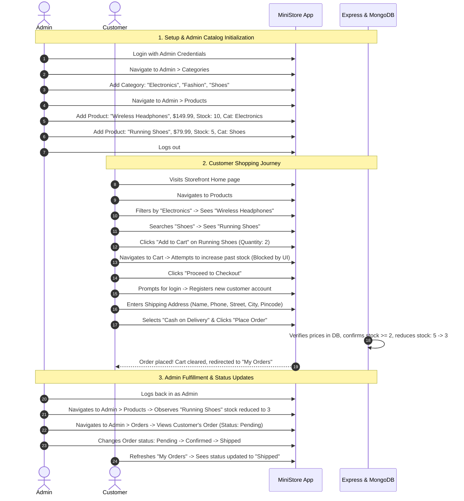

# Project Roadmap & End-to-End Demo Walkthrough

This document outlines the phased implementation roadmap, execution plan, and a comprehensive end-to-end demonstration script for the **Mini E-Commerce Demo Project**.

---

## 1. Phased Implementation Roadmap

When coding commences, development should be executed across structured, incremental phases:

```text
Phase 1: Backend Foundation (Express, MongoDB Connection, Base Middleware)
   ↓
Phase 2: Authentication System (User Model, bcrypt, JWT, Auth & Admin Middleware)
   ↓
Phase 3: Catalog & Category Management (Category & Product Models, CRUD APIs)
   ↓
Phase 4: Order Pipeline & Stock Engine (Order Model, COD Checkout, Stock Decrement)
   ↓
Phase 5: Frontend Scaffolding (Vite + React, Tailwind CSS Setup, Axios Client)
   ↓
Phase 6: Auth UI & State (AuthContext, Login, Register, Protected Routes)
   ↓
Phase 7: Storefront UI (Home, Products Catalog, Category Filter, Search Bar, Details)
   ↓
Phase 8: Shopping Cart & Checkout (CartContext, Stock Clamping, COD Checkout Form)
   ↓
Phase 9: Admin Dashboard (Sidebar, Categories CRUD, Products CRUD, Orders Status)
   ↓
Phase 10: End-to-End Testing & Verification Checklist
```

---

### Detailed Phase Breakdown

#### Phase 1: Backend Foundation
- Initialize Node.js environment (`npm init -y` in `/server`).
- Install dependencies: `express`, `mongoose`, `cors`, `dotenv`, `jsonwebtoken`, `bcryptjs`.
- Establish robust MongoDB connection via `config/db.js`.
- Set up global JSON parser and error handler middleware in `app.js`.

#### Phase 2: Authentication System
- Create `User.js` model with email regex and pre-save bcrypt password hashing hook.
- Implement `POST /api/auth/register` and `POST /api/auth/login`.
- Implement `authMiddleware.js` (verifies token) and `adminMiddleware.js` (checks role === 'admin').

#### Phase 3: Catalog & Category Management
- Create `Category.js` and `Product.js` Mongoose models.
- Implement Category CRUD APIs (`GET`, `POST`, `PUT`, `DELETE /api/categories`).
- Implement Product CRUD APIs (`GET`, `POST`, `PUT`, `DELETE /api/products`), including search query filter (`?search=...`) and category filter (`?category=...`).

#### Phase 4: Order Pipeline & Stock Engine
- Create `Order.js` model with shipping address sub-schema and line item snapshot schema.
- Implement `POST /api/orders`:
  - Validate non-empty cart.
  - Query DB for real-time prices (zero-trust pricing).
  - Check requested quantities against current `product.stock`.
  - Atomically decrement stock for all purchased items.
  - Create order document in MongoDB.
- Implement `GET /api/orders/my-orders` for customer history.
- Implement `GET /api/admin/orders` and `PATCH /api/admin/orders/:id/status` for admin fulfillment management.

#### Phase 5: Frontend Scaffolding
- Initialize React app using Vite (`npm create vite@latest client -- --template react`).
- Install and configure Tailwind CSS and Lucide React icons.
- Set up `axiosInstance.js` with base URL and authorization token interceptors.

#### Phase 6: Auth UI & State
- Create `AuthContext.jsx` with persistent token storage in `localStorage`.
- Build clean `Login.jsx` and `Register.jsx` pages with validation.
- Implement `AdminRoute.jsx` and `PrivateRoute.jsx` navigation guards.

#### Phase 7: Storefront UI
- Build responsive `Navbar.jsx` with active cart counter and auth dropdown.
- Implement `Home.jsx` with hero section and featured categories.
- Implement `Products.jsx` with category filter buttons (`All | Electronics | Fashion | Shoes`), search input, and responsive product grid.
- Implement `ProductDetails.jsx` with stock counter.

#### Phase 8: Shopping Cart & Checkout
- Create `CartContext.jsx` with stock limits enforcement on item increments.
- Build `Cart.jsx` page with item list, quantity buttons, and subtotal.
- Build `Checkout.jsx` page with shipping form (Name, Phone, Address, City, Pincode) and Cash on Delivery order placement.
- Redirect to `MyOrders.jsx` displaying newly created orders.

#### Phase 9: Admin Dashboard
- Build `AdminLayout.jsx` with responsive sidebar navigation.
- Implement `AdminCategories.jsx`: table view, add modal, edit modal, delete confirmation.
- Implement `AdminProducts.jsx`: table view, add/edit modal with image preview and category dropdown, delete confirmation.
- Implement `AdminOrders.jsx`: table with customer details and dropdown status updater (`Pending`, `Confirmed`, `Shipped`, `Delivered`, `Cancelled`).

---

## 2. End-to-End Demo Script

Follow this step-by-step sequence to demonstrate the entire application flow in a live evaluation:



---

## 3. Verification & Acceptance Checklist

| # | Requirement | Acceptance Criteria | Status |
| :---: | :--- | :--- | :---: |
| 1 | **Customer Auth** | Can register, login, and logout. JWT stored safely in localStorage. | Planned |
| 2 | **Admin Auth** | Admin routes reject non-admin users with 403 Forbidden. | Planned |
| 3 | **Category CRUD** | Admin can create, read, update, and delete categories. | Planned |
| 4 | **Product CRUD** | Admin can create, read, update, and delete products with category reference. | Planned |
| 5 | **Search & Filter** | Public users can filter by category and search by keyword in real time. | Planned |
| 6 | **Cart Stock Guard** | Users cannot add more units to the cart than the currently available stock. | Planned |
| 7 | **Zero-Trust Pricing** | Backend ignores submitted prices and retrieves actual prices from DB. | Planned |
| 8 | **Atomic Stock Decrement** | Completing an order reduces product stock in MongoDB immediately. | Planned |
| 9 | **Cash on Delivery** | Orders are recorded with COD payment method and shipping address. | Planned |
| 10 | **Order History** | Customers can view their historical orders and line items. | Planned |
| 11 | **Status Management** | Admin can cycle order status through all 5 lifecycle stages. | Planned |
| 12 | **Responsive Tailwind UI**| UI adapts gracefully between mobile screens, tablets, and desktops. | Planned |
